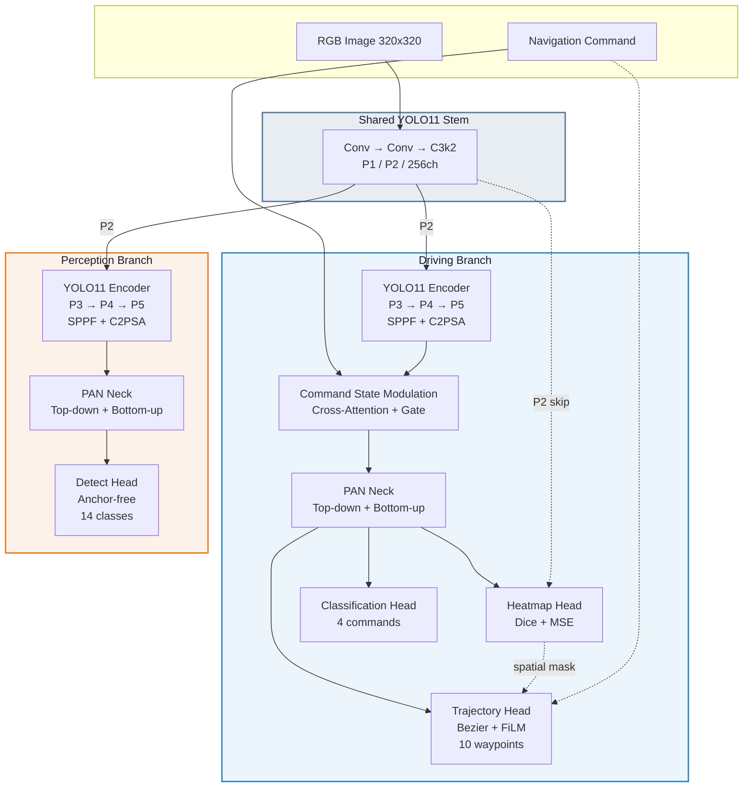

<p align="center">
  
</p>

<h1 align="center">NeuroPilot</h1>

<p align="center">
  <b>Unified End-to-End Autonomous Driving Framework</b><br/>
  Multi-Task Perception · Trajectory Prediction · Edge Deployment
</p>

<p align="center">
  <a href="https://www.python.org/downloads/"></a>
  <a href="https://pytorch.org/"></a>
  <a href="https://developer.nvidia.com/tensorrt"></a>
  <a href="LICENSE"></a>
</p>

---

NeuroPilot jointly learns **trajectory prediction**, **object detection**, **attention heatmap segmentation**, and **command classification** in a single forward pass. Designed for real-time edge deployment on **NVIDIA Jetson Orin Nano** with <30ms inference latency.

<p align="center">
  
</p>

---

## Table of Contents

- [Features](#features)
- [Architecture](#architecture)
- [Multi-Task Heads](#multi-task-heads)
- [Requirements](#requirements)
- [Installation](#installation)
- [Quick Start](#quick-start)
- [CLI Reference](#cli-reference)
- [Python API](#python-api)
- [Model Configurations](#model-configurations)
- [Dataset Reference](#dataset-reference)
- [Training Configuration](#training-configuration)
- [Export & Deployment](#export--deployment)
- [Project Structure](#project-structure)
- [Testing & Quality](#testing--quality)
- [Metrics](#metrics)
- [Extending NeuroPilot](#extending-neuropilot)
- [Roadmap](#roadmap)
- [Acknowledgments](#acknowledgments--references)
- [Authors](#authors)
- [License](#license)

---

## Features

- **Multi-Task Learning** — Trajectory, Detection (YOLO-style anchor-free), Heatmap, and Command Classification sharing a single backbone.
- **7 Model Architectures** — From lightweight Timm-based models to Dual-Branch and Causal Feature Routing (CFR) architectures.
- **Task-Aware Engine** — Dynamically toggle tasks via loss lambdas. Metrics, logs, and visualization adapt automatically.
- **Dataset Registry (OCP)** — `@register_dataset` decorator pattern. Adding datasets requires **zero** factory modifications.
- **FDAT Loss** — Frenet-Decomposed Anisotropic Trajectory Loss for lane-aware supervision.
- **SOTA Loss Functions** — Support for **Wing Loss** (high-precision landmark regression), SmoothL1, and L2.
- **Bézier Trajectory Head** — Cubic Bézier control points with FiLM command modulation and ego-speed conditioning.
- **Deformable Attention** — Optional Deformable Trajectory Head with cross-attention for precise waypoint regression.
- **JEPA World Model** — Optional Joint Embedding Predictive Architecture head for latent representation learning.
- **Pluggable Backbones** — Any `timm` model (MobileNetV4, EfficientViT, FastViT, MobileViT) via one YAML line, or use native Conv-based YOLO11 backbone.
- **5-Level Scaling** — `n` (nano), `s` (small), `m` (medium), `l` (large), `x` (extra-large) — one flag changes the entire model.
- **Extensive Temporal Video Support** — End-to-end processing of `.mp4` video pipelines alongside `JSONL` trajectory records using Decord. *(Run `PYTHONPATH=. uv run python examples/train_temporal.py` natively with the `neuralPilot_video.yaml` architecture).*
- **Epps-Pulley SIGReg** — State-of-the-art Sketch Isotropic Gaussian Regularizer preserving exact statistical sample sizing logic.
- **SOLID Neural Architecture** — Focused, abstracted neural blocks (`transformer.py`, `predictor.py`, `regularization.py`)
- **Edge-Ready** — ONNX & TensorRT export, <30ms on Jetson Orin Nano.
- **Beautiful Visualization** — Catmull-Rom spline trajectory rendering with gradient coloring, glow effects, and numbered waypoint nodes.

---

## Architecture



**Model Size:** ~2.8M params (scale=s, no Detect) · ~9.7M (scale=s, full multi-task)

---

## Multi-Task Heads

NeuroPilot supports **4 core tasks** that can be enabled/disabled independently via loss lambda weights:

| Task | Head Module | Output | Lambda | Description |
|---|---|---|---|---|
| **Trajectory** | `TrajectoryHead` / `DeformableTrajectoryHead` | `[T, 2]` waypoints in `[-1, 1]` | `lambda_traj` | Cubic Bézier control points with FiLM command modulation. Optionally uses deformable cross-attention. |
| **Detection** | `Detect` | Anchor-free bboxes + class scores | `lambda_det` | YOLO11-style DFL + CIoU loss. Multi-scale P3/P4/P5 prediction. |
| **Heatmap** | `HeatmapHead` | `[H, W]` attention map | `lambda_heatmap` | Full-resolution gaze/attention prediction. Fuses P3 neck + P2 backbone skip. |
| **Classification** | `ClassificationHead` | `[num_commands]` logits | `lambda_cls` | Navigation command prediction (Left/Right/Straight/Follow). |

**Optional experimental heads:**

| Head | Module | Lambda | Description |
|---|---|---|---|
| **JEPA** | `JEPAPredictor` | `lambda_jepa` | World-model latent representation learning |
| **Collision** | Built-in loss | `lambda_collision` | Collision avoidance penalization |
| **Progress** | Built-in loss | `lambda_progress` | Forward progress reward |

### Disabling Tasks

Set the corresponding lambda to `0.0` to completely disable a task during training. The head will still exist in the model graph but will produce no gradient.

```bash
# Trajectory-only training (disable detection, heatmap, gate)
uv run neuropilot train neuralPilot.yaml --data data/covla.yaml \
    lambda_det=0.0 lambda_heatmap=0.0 lambda_gate=0.0

# Detection + Trajectory (disable heatmap)
uv run neuropilot train neuralPilot.yaml --data data/yolo_dataset.yaml \
    lambda_heatmap=0.0
```

---

## Requirements

| Component | Minimum |
|---|---|
| Python | ≥ 3.10 |
| CUDA | ≥ 11.8 |
| GPU VRAM | ≥ 4 GB |
| Tested on | RTX 3060, Jetson Orin Nano |

---

## Installation

```bash
# Install uv (fast Python package manager)
curl -LsSf https://astral.sh/uv/install.sh | sh

# Clone & install
git clone https://github.com/vtnguyen04/neuralPilot.git
cd neuralPilot
uv sync
```

### Development Setup

```bash
# Install with dev dependencies (ruff, mypy, pytest)
uv sync --group dev
```

---

## Quick Start

```bash
# Train with default settings
uv run neuropilot train neuralPilot.yaml --data data/your_dataset.yaml

# Run inference on a video
uv run neuropilot predict video.mp4 --model best.pt --save

# Export to ONNX
uv run neuropilot export --model best.pt --format onnx --imgsz 320

# Benchmark performance
uv run neuropilot benchmark --model best.pt --imgsz 320
```

---

## CLI Reference

NeuroPilot provides a unified CLI via the `neuropilot` command. All modes accept additional keyword arguments as `key=value` pairs.

### `train` — Train a Model

```bash
uv run neuropilot train <MODEL_CONFIG> [OPTIONS] [KEY=VALUE ...]
```

| Argument | Type | Default | Description |
|---|---|---|---|
| `MODEL_CONFIG` | positional | — | Path to model YAML (e.g. `neuralPilot.yaml`) |
| `--data` | str | — | Path to dataset YAML |
| `--epochs` | int | `100` | Number of training epochs |
| `--batch` | int | `16` | Batch size |
| `--imgsz` | int | `640` | Input image size |
| `--device` | str | `"0"` | CUDA device ID |

**Extra kwargs** (passed as `key=value`):

| Key | Example | Description |
|---|---|---|
| `model_scale` | `model_scale=s` | Model scale: `n`, `s`, `m`, `l`, `x` |
| `lambda_traj` | `lambda_traj=5.0` | Trajectory loss weight |
| `lambda_det` | `lambda_det=0.0` | Detection loss weight (0 = disabled) |
| `lambda_heatmap` | `lambda_heatmap=2.0` | Heatmap loss weight |
| `lambda_cls` | `lambda_cls=1.0` | Classification loss weight |
| `use_fdat` | `use_fdat=True` | Enable FDAT trajectory loss |
| `experiment_name` | `experiment_name=exp1` | Experiment output directory |
| `resume` | `resume=True` | Resume from last checkpoint |
| `learning_rate` | `learning_rate=1e-4` | Initial learning rate |
| `patience` | `patience=20` | Early stopping patience |

**Examples:**

```bash
# Full multi-task training with scale=s
uv run neuropilot train neuralPilot.yaml \
    --data data/yolo_dataset.yaml \
    --epochs 200 --batch 32 --imgsz 320 \
    model_scale=s experiment_name=full_mt

# Trajectory-only with FDAT loss on CoVLA data
uv run neuropilot train neuralPilot_covla.yaml \
    --data data/covla.yaml \
    --epochs 150 --batch 64 --imgsz 320 \
    model_scale=s lambda_det=0.0 use_fdat=True \
    fdat_alpha_lane=15.0 experiment_name=traj_fdat

# Resume training from checkpoint
uv run neuropilot train neuralPilot.yaml \
    --data data/yolo_dataset.yaml \
    resume=True experiment_name=full_mt

# Deformable attention model with JEPA world model
uv run neuropilot train neuralPilot_deformable.yaml \
    --data data/covla.yaml \
    model_scale=s lambda_jepa=0.5

# Temporal Video Training (using script entrypoint)
PYTHONPATH=. uv run python examples/train_temporal.py
```

---

### `predict` — Run Inference

```bash
uv run neuropilot predict <SOURCE> --model <WEIGHTS> [OPTIONS] [KEY=VALUE ...]
```

| Argument | Type | Default | Description |
|---|---|---|---|
| `SOURCE` | positional | — | Input source: image, directory, video, or webcam (`0`) |
| `--model` | str | required | Path to weights (`.pt`, `.onnx`, `.engine`) |
| `--conf` | float | `0.25` | Detection confidence threshold |
| `--imgsz` | int | `640` | Input image size |
| `--stream` | flag | `False` | Stream mode for real-time |
| `--save` | flag | `False` | Save output to `runs/predict/` |

**Extra kwargs:**

| Key | Example | Description |
|---|---|---|
| `scale` | `scale=s` | Model scale (required for `.onnx`) |
| `heatmap` | `heatmap=False` | Disable heatmap panel in output |

**Examples:**

```bash
# Inference on video, save output
uv run neuropilot predict video.mp4 \
    --model best.pt --imgsz 320 --save

# ONNX inference without heatmap overlay
uv run neuropilot predict video.mp4 \
    --model neuro_pilot_model.onnx --imgsz 320 \
    --save scale=s heatmap=False

# Inference on image directory
uv run neuropilot predict images/ \
    --model best.pt --conf 0.3

# Webcam real-time inference
uv run neuropilot predict 0 \
    --model best.pt --stream
```

---

### `export` — Export Model

```bash
uv run neuropilot export --model <WEIGHTS> [OPTIONS]
```

| Argument | Type | Default | Description |
|---|---|---|---|
| `--model` | str | required | Path to `.pt` weights |
| `--format` | str | `onnx` | Export format: `onnx`, `engine` |
| `--imgsz` | int | `640` | Input resolution |
| `--dynamic` | flag | `False` | Enable dynamic batch size |

**Extra kwargs:**

| Key | Example | Description |
|---|---|---|
| `model_scale` | `model_scale=s` | Model scale (must match training) |

**Examples:**

```bash
# Export to ONNX
uv run neuropilot export --model best.pt --format onnx --imgsz 320 model_scale=s

# Export to TensorRT engine
uv run neuropilot export --model best.pt --format engine --imgsz 320 model_scale=s
```

---

### `val` — Validate Model

```bash
uv run neuropilot val --model <WEIGHTS> [OPTIONS]
```

| Argument | Type | Default | Description |
|---|---|---|---|
| `--model` | str | required | Path to weights |
| `--data` | str | — | Dataset configuration YAML |
| `--imgsz` | int | `640` | Input resolution |

---

### `benchmark` — Benchmark Performance

```bash
uv run neuropilot benchmark --model <WEIGHTS> [OPTIONS]
```

| Argument | Type | Default | Description |
|---|---|---|---|
| `--model` | str | required | Path to weights |
| `--imgsz` | int | `640` | Input resolution |
| `--batch` | int | `1` | Batch size |

**Example:**

```bash
uv run neuropilot benchmark --model best.pt --imgsz 320 --batch 1
```

---

## Python API

### Training

```python
from neuro_pilot.engine.model import NeuroPilot

# Initialize model from config
model = NeuroPilot(
    model="neuro_pilot/cfg/models/neuralPilot.yaml",
    scale="s"
)

# Full multi-task training
model.train(
    data="data/yolo_dataset.yaml",

    # Training
    max_epochs=100,
    batch_size=16,
    learning_rate=5e-4,

    # Task weights (set 0.0 to disable)
    lambda_traj=5.0,
    lambda_det=1.0,
    lambda_heatmap=2.0,
    lambda_gate=0.5,
    lambda_cls=1.0,

    # Detection sub-losses
    box=2.5,
    cls_det=10.0,
    dfl=4.0,

    # FDAT trajectory loss
    use_fdat=True,
    fdat_alpha_lane=15.0,

    # Augmentation
    rotate_deg=5.0,
    mosaic=0.0,

    experiment_name="my_experiment"
)
```

### Inference

```python
from neuro_pilot.engine.model import NeuroPilot

# Load from checkpoint
model = NeuroPilot(model="experiments/default/weights/best.pt", scale="s")

# Predict on video
results = model.predict("video.mp4", imgsz=320, conf=0.25)

for res in results:
    # res.boxes     → Detection bounding boxes (Tensor)
    # res.waypoints → Predicted trajectory (Tensor[T, 2])
    # res.heatmap   → Attention heatmap (Tensor[H, W])
    # res.command   → Navigation command index (int)

    img = res.plot()           # Annotated image with all overlays
    img = res.plot(heatmap=False)  # Without heatmap panel
    res.save()                 # Save to runs/predict/
```

### Export

```python
model = NeuroPilot(model="best.pt", scale="s")

# Export to ONNX
onnx_path = model.export(format="onnx", imgsz=320)

# Export to TensorRT
engine_path = model.export(format="engine", imgsz=320)
```

### Benchmark

```python
model = NeuroPilot(model="best.pt", scale="s")

results = model.benchmark(imgsz=320, batch=1)
print(f"Latency: {results['latency_ms']:.2f} ms")
print(f"Throughput: {results['fps']:.2f} FPS")
```

### Validation

```python
model = NeuroPilot(model="best.pt", scale="s")
metrics = model.val(imgsz=320)
```

### Loading ONNX / TensorRT models

```python
# The same API works seamlessly with exported models
model = NeuroPilot(model="neuro_pilot_model.onnx", scale="s")
results = model.predict("video.mp4", imgsz=320)
```

---

## Model Configurations

All model architectures are defined as YAML files in `neuro_pilot/cfg/models/`. Each supports 5 scaling levels.

### Available Architectures

| Config | Backbone | Heads | Use Case |
|---|---|---|---|
| `neuralPilot.yaml` | Timm (MobileNetV4-S) | Detect + Heatmap + Trajectory + Classification | Full multi-task with YOLO-format data |
| `neuralPilot_covla.yaml` | Timm (MobileNetV4-S) | Heatmap + Trajectory + Classification (60 wp) | Trajectory-focused with CoVLA data |
| `neuralPilot_deformable.yaml` | Timm (MobileNetV4-S) | Detect + Heatmap + **Deformable** Trajectory + Classification + JEPA | Research: deformable attention + world model |
| `neuralPilot_yolo11.yaml` | Native Conv (YOLO11) | Detect + Heatmap + Trajectory + Classification | No Timm dependency, pure Conv backbone |
| `neuralPilot_dual.yaml` | Shared Conv Stem | **Driving Branch** (Heatmap+Traj+Cls) + **Perception Branch** (Detect) | Dual-branch: separate driving & perception |
| `neuralPilot_cfr.yaml` | Shared Conv Stem | **Perception** (Detect) → CFRBridge → **Driving** (Heatmap+Traj+Cls) | Causal Feature Routing: perception informs planning |
| `neuralPilot_60wp.yaml` | Timm (MobileNetV4-S) | Full multi-task (60 waypoints) | Long-horizon trajectory prediction |
| `neuralPilot_video.yaml` | Timm (MobileNetV4-S) | **TemporalTrajectoryHead** + Detect | End-to-end Video Trajectory Forecasting with Temporal Sequence mapping |

### Model Scaling

Each model YAML defines 5 scales that control depth, width, and max channels:

```yaml
scales:
  # [depth_multiplier, width_multiplier, max_channels]
  n: [0.33, 0.25, 1024]   # Nano   — fastest, smallest
  s: [0.33, 0.50, 1024]   # Small  — balanced
  m: [0.67, 0.75, 768]    # Medium — higher accuracy
  l: [1.00, 1.00, 512]    # Large  — best accuracy
  x: [1.00, 1.25, 512]    # Extra  — maximum capacity
```

Select scale via CLI or API:

```bash
uv run neuropilot train neuralPilot.yaml --data data.yaml model_scale=s
```

```python
model = NeuroPilot(model="neuralPilot.yaml", scale="s")
```

### Changing the Backbone

For Timm-based configs, edit one line in the model YAML:

```yaml
backbone:
  # MobileNetV4-Small (CNN, 3.5M, fastest)
  - [-1, 1, TimmBackbone, ['mobilenetv4_conv_small.e2400_r224_in1k', True, True]]

  # EfficientViT-B1 (ViT, 4.6M, attention-based)
  # - [-1, 1, TimmBackbone, ['efficientvit_b1.r224_in1k', True, True]]

  # FastViT-T8 (Apple hybrid, 3.2M)
  # - [-1, 1, TimmBackbone, ['fastvit_t8.apple_dist_in1k', True, True]]

  # MobileViT-S (Apple mobile ViT, 4.5M)
  # - [-1, 1, TimmBackbone, ['mobilevitv2_050.cvnets_in1k', True, True]]
```

Any model from the [timm model zoo](https://huggingface.co/docs/timm) can be used. The `TimmBackbone` module automatically extracts multi-scale features (P2–P5).

### Model YAML Format

```yaml
nc: 14          # Number of detection classes
nm: 4           # Number of navigation commands
nw: 10          # Number of trajectory waypoints

scales:
  n: [0.33, 0.25, 1024]
  s: [0.33, 0.50, 1024]
  # ...

backbone:
  # [from, repeats, module, args]
  - [-1, 1, TimmBackbone, ['model_name', pretrained, features_only]]

head:
  # Feature routing, fusion, neck, and task heads
  - [0, 1, FeatureRouter, [4]]        # Select P5
  - [1, 1, LanguagePromptEncoder, [256, nm, 'embedding']]
  # ... neck layers ...
  - [[14, 17, 20], 1, Detect, [nc]]   # Detection head
  - [[14, 4], 1, HeatmapHead, [1, 64, 3]]  # Heatmap head
  - [[20, 22], 1, TrajectoryHead, [nm, nw]] # Trajectory head
  - [20, 1, ClassificationHead, [nm]]       # Command head
```

---

## Dataset Reference

NeuroPilot supports two dataset paradigms: **YOLO format** (folder-based) and **Registry format** (adapter-based).

### YOLO Format

Standard YOLO folder structure with detection labels + optional waypoint/heatmap annotations.

```yaml
# data/my_dataset.yaml
path: /path/to/dataset
train: images/train
val: images/val
names:
  0: car
  1: truck
  2: pedestrian
  3: bicycle
  # ... up to 14 classes
```

**Expected folder structure:**

```
dataset/
├── images/
│   ├── train/
│   │   ├── 0001.jpg
│   │   └── ...
│   └── val/
├── labels/
│   ├── train/
│   │   ├── 0001.txt    # YOLO format: class cx cy w h
│   │   └── ...
│   └── val/
├── waypoints/           # Optional
│   ├── train/
│   │   ├── 0001.txt    # T lines of: x y (normalized)
│   │   └── ...
│   └── val/
└── heatmaps/            # Optional
    ├── train/
    │   ├── 0001.png
    │   └── ...
    └── val/
```

### Registry Format — Video Driving (Temporal Video Support)

The `video_driving` adapter natively supports parsing `.mp4` files coupled with frame-by-frame JSONL labels, grouping them into temporal sequences for Video Trajectory Prediction.

```yaml
# data/video.yaml
type: video_driving
path: data/covla
train: state.jsonl
format: jsonl
```

**Expected structure (Layout 1: CoVLA-style JSONL):**

```
data/covla/
├── state.jsonl           # Per-frame annotations (trajectory, ego_state, matrices)
└── videos/
    ├── sequence_001.mp4
    ├── sequence_002.mp4
```

**Supported Annotations in JSONL:**

| Field | Type | Description |
|---|---|---|
| `video_path` | str | Relative path to `.mp4` video (Fallback: `sequence_id`) |
| `frame_idx` | int | Temporal index of the frame |
| `trajectory` | `[[x,y,z], ...]` | 3D future trajectory points (auto-projected) |
| `extrinsic_matrix` | `4×4 float[][]` | Camera extrinsic matrix |
| `intrinsic_matrix` | `3×3 float[][]` | Camera intrinsic matrix |
| `ego_state.vEgo` | float | Ego speed (m/s) for conditioning |
| `ego_state.leftBlinker` | bool | Left turn signal |

*Note: You can also place raw images inside directories instead of `.mp4` files, and the Dataset adapter will automatically fall back to processing frame images.*

### Adding a Custom Dataset

```python
# neuro_pilot/data/datasets/my_dataset.py
from .base import BaseDrivingDataset, register_dataset

@register_dataset("my_type")
class MyDataset(BaseDrivingDataset):
    def __getitem__(self, idx) -> dict:
        return {
            "image": tensor,          # [C, H, W] normalized
            "waypoints": tensor,      # [T, 2] in [-1, 1]
            "command": int_or_onehot, # Navigation command
            "command_idx": int,       # Command index
            "bboxes": tensor,         # [N, 4] or empty
            "cls": tensor,            # [N] class labels
            "heatmap": tensor,        # [H/4, W/4] attention
            "waypoints_mask": float,  # 1.0 if valid, 0.0 if missing
        }

    def __len__(self) -> int:
        return len(self.data)

    @classmethod
    def from_config(cls, config, split, yaml_dict):
        return cls(
            data_dir=yaml_dict.get('path'),
            img_size=config.data.image_size,
            split=split,
        )
```

Then import in `datasets/__init__.py`:
```python
from . import my_dataset
```

Use it with:
```yaml
# data/my_data.yaml
type: my_type
path: /path/to/data
```

**No factory code changes needed.**

---

## Training Configuration

All training hyperparameters are defined in `neuro_pilot/cfg/default.yaml` and validated by `neuro_pilot/cfg/schema.py` (Pydantic).

### Loss Weights

| Parameter | Default | Description |
|---|---|---|
| `lambda_traj` | `2.0` | Trajectory prediction loss multiplier |
| `lambda_det` | `1.0` | Object detection loss multiplier |
| `lambda_heatmap` | `1.0` | Attention heatmap loss multiplier |
| `lambda_cls` | `1.0` | Command classification loss multiplier |
| `lambda_gate` | `0.0` | Command gating loss multiplier |
| `lambda_smooth` | `0.1` | Trajectory smoothness regularization |
| `lambda_collision` | `0.0` | Collision avoidance penalization (experimental) |
| `lambda_progress` | `0.0` | Forward progress reward (experimental) |
| `lambda_jepa` | `0.0` | JEPA world model consistency loss |
| `lambda_sigreg` | `0.0` | SIGReg isotropic regularization (Epps-Pulley Statistic). *Note: Needs tuning based on model Batch Size* |

### FDAT (Frenet-Decomposed Anisotropic Trajectory Loss)

| Parameter | Default | Description |
|---|---|---|
| `use_fdat` | `True` | Toggle FDAT (False = SmoothL1) |
| `fdat_alpha_lane` | `10.0` | Cross-track penalty (lane following) |
| `fdat_beta_lane` | `1.0` | Along-track penalty (lane following) |
| `fdat_alpha_inter` | `5.0` | Cross-track penalty (intersection) |
| `fdat_beta_inter` | `3.0` | Along-track penalty (intersection) |
| `fdat_lambda_heading` | `2.0` | Heading consistency weight |
| `fdat_lambda_endpoint` | `5.0` | Endpoint anchor weight |

### Detection Sub-Losses

| Parameter | Default | Description |
|---|---|---|
| `box` | `7.5` | Box IoU loss multiplier |
| `cls_det` | `0.5` | Box classification loss multiplier |
| `dfl` | `1.5` | Distribution Focal Loss multiplier |

### Trainer

| Parameter | Default | Description |
|---|---|---|
| `max_epochs` | `300` | Maximum training epochs |
| `learning_rate` | `0.001` | Initial LR (SGD=1e-2, Adam=1e-3) |
| `lr_final` | `0.01` | Final LR ratio (`lr * lr_final`) |
| `lr_schedule` | `"cosine"` | LR scheduler type |
| `optimizer` | `"AdamW"` | Optimizer |
| `momentum` | `0.937` | SGD momentum / Adam beta1 |
| `weight_decay` | `0.0005` | Weight decay |
| `warmup_epochs` | `3.0` | Warmup epochs (fractions OK) |
| `use_amp` | `True` | Automatic Mixed Precision |
| `use_ema` | `True` | Exponential Moving Average |
| `ema_decay` | `0.999` | EMA decay factor |
| `grad_clip_norm` | `10.0` | Gradient clipping threshold |
| `early_stop_patience` | `10` | Early stopping patience |
| `checkpoint_top_k` | `3` | Keep top-K best checkpoints |
| `cmd_dropout_prob` | `0.4` | Command dropout (forces visual learning) |

### Data & Augmentation

| Parameter | Default | Description |
|---|---|---|
| `image_size` | `320` | Input resolution |
| `batch_size` | `32` | Training batch size |
| `num_workers` | `4` | DataLoader workers |
| `hsv_h` | `0.015` | HSV hue augmentation |
| `hsv_s` | `0.7` | HSV saturation augmentation |
| `hsv_v` | `0.4` | HSV value augmentation |
| `color_jitter` | `0.3` | Brightness/contrast jitter |
| `noise_prob` | `0.2` | Gaussian noise probability |
| `blur_prob` | `0.1` | Motion/Gaussian blur probability |
| `mosaic` | `0.0` | Mosaic augmentation probability |
| `mixup` | `0.0` | MixUp augmentation probability |
| `fliplr` | `0.0` | Horizontal flip probability |

### Trajectory Loss Benchmarking

NeuroPilot supports automated benchmarking for different SOTA loss functions to find the optimal configuration for your dataset.

You can run the built-in benchmark script to compare **SmoothL1**, **MSE (L2)**, and **Wing Loss** both with and without **FDAT** decomposition:

```bash
# Run the automated benchmark suite
PYTHONPATH=. python scripts/benchmark_losses.py
```

This will run 5 sequential experiments:
1. **Baseline L2** — Basic point regression.
2. **Standard SmoothL1** — Industrial standard.
3. **SOTA Wing** — High-precision regression.
4. **FDAT (Ours)** — Frenet-Decomposed trajectory.
5. **FDAT + Wing** — Combined optimal approach.

Results for each experiment are stored in `runs/<exp_name>/` for direct comparison of ADE/FDE and lateral deviation.

---

## Export & Deployment

### ONNX Export

```bash
uv run neuropilot export --model best.pt --format onnx --imgsz 320 model_scale=s
```

Output: `neuro_pilot_model.onnx`

### TensorRT Export

```bash
# Via NeuroPilot CLI
uv run neuropilot export --model best.pt --format engine --imgsz 320 model_scale=s

# Or via trtexec for fine-tuned control
trtexec --onnx=neuro_pilot_model.onnx \
    --saveEngine=neuro_pilot_model.engine \
    --fp16 --workspace=4096
```

### Inference with Exported Models

```bash
# ONNX inference
uv run neuropilot predict video.mp4 \
    --model neuro_pilot_model.onnx --imgsz 320 --save scale=s

# TensorRT inference
uv run neuropilot predict video.mp4 \
    --model neuro_pilot_model.engine --imgsz 320 --save scale=s
```

### Supported Backends

| Format | Extension | GPU Accel | Notes |
|---|---|---|---|
| PyTorch | `.pt` | ✅ CUDA | Native, full feature support |
| ONNX | `.onnx` | ✅ CUDA/CPU | Requires `onnxruntime-gpu` |
| TensorRT | `.engine` | ✅ CUDA | Fastest, Jetson-optimized |

---

## Project Structure

```
neuralPilot/
├── neuro_pilot/
│   ├── cfg/                      # Configuration
│   │   ├── default.yaml          #   Default hyperparameters
│   │   ├── schema.py             #   Pydantic AppConfig validation
│   │   └── models/               #   7 architecture YAMLs
│   │       ├── neuralPilot.yaml
│   │       ├── neuralPilot_covla.yaml
│   │       ├── neuralPilot_deformable.yaml
│   │       ├── neuralPilot_yolo11.yaml
│   │       ├── neuralPilot_dual.yaml
│   │       ├── neuralPilot_cfr.yaml
│   │       └── neuralPilot_60wp.yaml
│   ├── core/                     # Central Registry
│   ├── data/                     # Data pipeline
│   │   ├── datasets/             #   Adapters (base, covla_local, covla_hf)
│   │   ├── augment.py            #   Mosaic, MixUp, HSV, Noise, Blur
│   │   ├── neuro_pilot_dataset.py#   YOLO-format dataset
│   │   └── build.py              #   InfiniteDataLoader factory
│   ├── deploy/                   # ONNX / TensorRT backends
│   ├── engine/                   # Core engine
│   │   ├── model.py              #   NeuroPilot unified interface
│   │   ├── trainer.py            #   Training loop
│   │   ├── predictor.py          #   Inference pipeline
│   │   ├── exporter.py           #   Model export
│   │   ├── results.py            #   Results & visualization
│   │   └── backend/              #   AutoBackend (PyTorch/ONNX/TRT)
│   ├── nn/modules/               # Neural network modules
│   │   ├── backbone.py           #   TimmBackbone wrapper
│   │   ├── head.py               #   Task heads (Detect, Trajectory, Heatmap, etc.)
│   │   ├── attention.py          #   Attention mechanisms (C2PSA, VLFusion)
│   │   ├── deformable.py         #   Deformable attention modules
│   │   ├── block.py              #   C3k2, SPPF, BottleneckCSP
│   │   ├── conv.py               #   Conv, DWConv, GhostConv
│   │   ├── jepa.py               #   JEPA world model predictor
│   │   └── routing.py            #   CFRBridge, FeatureRouter
│   ├── utils/                    # Utilities
│   │   ├── ops.py                #   Box/coord transforms
│   │   ├── plotting.py           #   Annotator, trajectory visualization
│   │   ├── nms.py                #   Non-Maximum Suppression
│   │   ├── metrics.py            #   ADE, FDE, mAP
│   │   └── logger.py             #   Logging setup
│   ├── entrypoint.py             # CLI entry point
│   └── main.py                   # Alternative entry point
├── tests/                        # Unit + integration tests
├── tools/                        # Development scripts
├── assets/                       # Logo & media
└── pyproject.toml                # Dependencies (uv)
```

---

## Testing & Quality

```bash
# Run all tests
uv run pytest tests/

# Integration tests only
uv run pytest tests/integration/

# Lint check
uv run ruff check .

# Type check
uv run mypy neuro_pilot/
```

---

## Metrics

### Trajectory

| Metric | Description |
|---|---|
| L1 / Weighted L1 | Mean absolute error (time-weighted) |
| ADE | Average Displacement Error |
| FDE | Final Displacement Error |
| Lateral / Longitudinal | Frenet-decomposed components |

### Detection

| Metric | Description |
|---|---|
| mAP@50 | Mean AP at IoU = 0.50 |
| mAP@50-95 | Mean AP at IoU 0.50:0.05:0.95 |

---

## Extending NeuroPilot

### Adding a Dataset

See [Dataset Reference → Adding a Custom Dataset](#adding-a-custom-dataset).

### Adding a New Head

1. Create a new `nn.Module` in `neuro_pilot/nn/modules/head.py`
2. Register it in `neuro_pilot/nn/modules/__init__.py`
3. Add it to your model YAML under the `head:` section
4. Add corresponding loss computation in the task's `compute_loss` method

### Creating a New Architecture

1. Copy an existing YAML from `neuro_pilot/cfg/models/`
2. Modify backbone, neck, or head layers
3. Adjust `nc`, `nm`, `nw` parameters as needed
4. Use it directly: `uv run neuropilot train my_arch.yaml --data data.yaml`

---

## Roadmap

- [x] Multi-task engine (Trajectory + Detection + Heatmap)
- [x] Dataset Registry with `@register_dataset` (OCP)
- [x] Task-aware metrics & visualization
- [x] FDAT loss
- [x] ONNX + TensorRT export
- [x] Deformable Trajectory Head
- [x] JEPA World Model head
- [x] Dual-Branch architecture
- [x] Causal Feature Routing (CFR)
- [x] Catmull-Rom spline trajectory visualization
- [ ] SOTA Auto-Regressive Trajectory Head (GRU + Cross-Attention)
- [ ] BEV transform module
- [ ] nuScenes / Waymo dataset adapters

---

## Acknowledgments & References

NeuroPilot builds upon and is inspired by the following outstanding open-source projects and research:

| Project | Role in NeuroPilot |
|---|---|
| [Ultralytics YOLOv8/v11](https://github.com/ultralytics/ultralytics) | Detection head architecture, anchor-free design, DFL, training pipeline patterns |
| [timm (PyTorch Image Models)](https://github.com/huggingface/pytorch-image-models) | Backbone zoo — MobileNetV4, EfficientViT, FastViT, MobileViT |
| [CoVLA Dataset](https://huggingface.co/datasets/turing-motors/CoVLA-Dataset-Mini) | Vision-Language-Action driving dataset |
| [NVIDIA TensorRT](https://developer.nvidia.com/tensorrt) | Edge inference optimization |
| [Pydantic](https://docs.pydantic.dev/) | Configuration schema validation |
| [uv](https://docs.astral.sh/uv/) | High-speed Python dependency management |

---

## Authors

**Vo Thanh Nguyen** · [thcs2nguyen@gmail.com](mailto:thcs2nguyen@gmail.com) · [GitHub](https://github.com/vtnguyen04)

---

## License

[MIT License](LICENSE)
