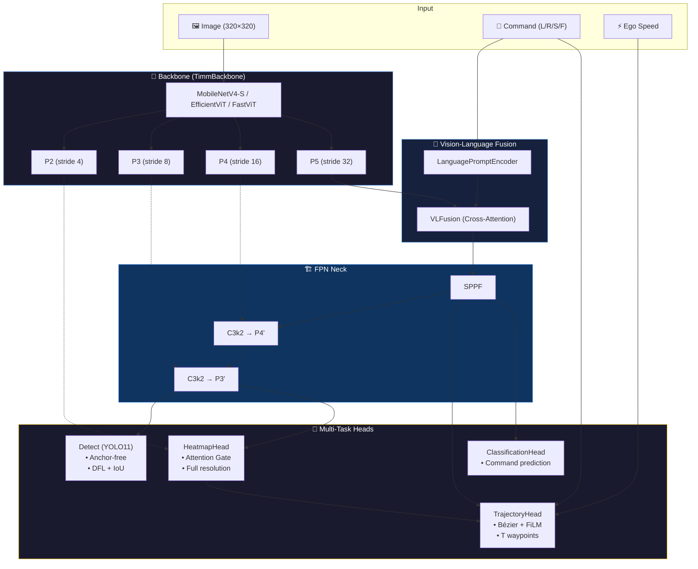

<p align="center">
  
</p>

<h1 align="center">NeuroPilot</h1>

<p align="center">
  <b>Unified End-to-End Autonomous Driving Framework</b><br/>
  Multi-Task Perception · Trajectory Prediction · Edge Deployment
</p>

<p align="center">
  <a href="https://www.python.org/downloads/"></a>
  <a href="https://pytorch.org/"></a>
  <a href="https://developer.nvidia.com/tensorrt"></a>
  <a href="LICENSE"></a>
</p>

---

NeuroPilot jointly learns **trajectory prediction**, **object detection**, **attention heatmap segmentation**, and **command classification** in a single forward pass. Designed for real-time edge deployment on **NVIDIA Jetson Orin Nano** with <30ms inference latency.

---

## Table of Contents

- [Features](#features)
- [Architecture](#architecture)
- [Requirements](#requirements)
- [Installation](#installation)
- [Usage](#usage)
- [Configuration](#configuration)
- [Project Structure](#project-structure)
- [Testing](#testing)
- [Metrics](#metrics)
- [Extending NeuroPilot](#extending-neuropilot)
- [Roadmap](#roadmap)
- [Authors](#authors)
- [License](#license)

---

## Features

- **Multi-Task Learning** — Trajectory, Detection (YOLO), Heatmap, and Command Classification sharing a single backbone.
- **Task-Aware Engine** — Dynamically toggle tasks via loss lambdas. Metrics, logs, and visualization adapt automatically.
- **Dataset Registry (OCP)** — `@register_dataset` decorator pattern. Adding datasets requires **zero** factory modifications.
- **FDAT Loss** — Frenet-Decomposed Anisotropic Trajectory Loss for lane-aware supervision.
- **Bézier Trajectory Head** — Cubic Bézier control points with FiLM command modulation and ego-speed conditioning.
- **Pluggable Backbones** — Any `timm` model (MobileNetV4, EfficientViT, FastViT, MobileViT) via one YAML line.
- **Edge-Ready** — ONNX & TensorRT export, <30ms on Jetson Orin Nano.

---

## Architecture



**Model Size:** ~2.8M params (scale=s, no Detect) · ~9.7M (scale=s, full multi-task)

---

## Requirements

| Component | Minimum |
|---|---|
| Python | ≥ 3.10 |
| CUDA | ≥ 11.8 |
| GPU VRAM | ≥ 4 GB |
| Tested on | RTX 3060, Jetson Orin Nano |

---

## Installation

```bash
# Install uv (fast Python package manager)
curl -LsSf https://astral.sh/uv/install.sh | sh

# Clone & install
git clone https://github.com/vtnguyen04/neuralPilot.git
cd neuralPilot
uv sync
```

---

## Usage

### CLI

```bash
# Full multi-task training
uv run python neuro_pilot/main.py train neuro_pilot_e2e \
    --data data/your_dataset.yaml \
    --epochs 100 --batch 32 --scale s

# Trajectory-only (disable other tasks)
uv run python neuro_pilot/main.py train neuro_pilot_e2e \
    --data data/covla.yaml --scale s \
    lambda_det=0.0 lambda_heatmap=0.0 lambda_gate=0.0

# Inference
uv run python neuro_pilot/main.py predict \
    --model experiments/default/weights/best.pt \
    --source path/to/video.mp4 --conf 0.25

# Export to ONNX
uv run python neuro_pilot/main.py export \
    --model experiments/default/weights/best.pt --format onnx

# Validate
uv run python neuro_pilot/main.py val \
    --model experiments/default/weights/best.pt \
    --data data/your_dataset.yaml
```

### Python API

```python
from neuro_pilot.engine.model import NeuroPilot

model = NeuroPilot(model="neuro_pilot/cfg/models/neuralPilot.yaml", scale="s")

model.train(
    data="data/covla.yaml",

    # Training
    max_epochs=100,
    batch_size=16,
    learning_rate=5e-4,

    # Task weights (set 0.0 to disable)
    lambda_traj=5.0,
    lambda_det=1.0,
    lambda_heatmap=2.0,
    lambda_gate=0.5,

    # Detection sub-losses
    box=2.5,
    cls_det=10.0,
    dfl=4.0,

    # FDAT trajectory loss
    use_fdat=True,
    fdat_alpha_lane=15.0,

    # Augmentation
    rotate_deg=5.0,
    mosaic=0.0,

    experiment_name="my_experiment"
)
```

---

## Configuration

### Model Architecture

Defined in YAML files under `neuro_pilot/cfg/models/`:

| Config | Heads | Use Case |
|---|---|---|
| `neuralPilot.yaml` | Detect + Heatmap + Trajectory + Classification | Full multi-task (YOLO data) |
| `neuralPilot_covla.yaml` | Heatmap + Trajectory + Classification | Trajectory-focused (CoVLA data) |

### Dataset

**YOLO format** (no `type` needed):
```yaml
path: /path/to/dataset
train: images/train
val: images/val
names: {0: car, 1: truck, 2: pedestrian}
```

**Registry format** (custom adapters):
```yaml
type: covla_local
path: data/covla
```

Registered types: `covla_local`, `covla_hf`

### Task Selection

| Task | Lambda | Default |
|---|---|---|
| Trajectory | `lambda_traj` | `2.0` |
| Detection | `lambda_det` | `1.0` |
| Heatmap | `lambda_heatmap` | `1.0` |
| Gate | `lambda_gate` | `0.0` |

Full parameter reference: [`neuro_pilot/cfg/schema.py`](neuro_pilot/cfg/schema.py)

---

## Project Structure

```
neuralPilot/
├── neuro_pilot/
│   ├── cfg/                  # Config (YAML defaults + Pydantic schema)
│   │   ├── default.yaml      #   Training / loss / augmentation
│   │   ├── schema.py         #   Validated AppConfig
│   │   └── models/           #   Architecture definitions
│   ├── core/                 # Central Registry
│   ├── data/                 # Data pipeline
│   │   ├── datasets/         #   Adapters (base, covla_local, covla_hf)
│   │   ├── augment.py        #   Mosaic, MixUp, HSV, etc.
│   │   └── build.py          #   InfiniteDataLoader factory
│   ├── deploy/               # ONNX / TensorRT backends
│   ├── engine/               # Trainer, Validator, Callbacks
│   ├── nn/modules/           # Backbone, Heads, Blocks, Attention
│   └── utils/                # Losses, Metrics, Plotting
├── tests/                    # 95 tests (unit + integration)
├── tools/                    # Development scripts
├── assets/                   # Logo & media
└── pyproject.toml            # Dependencies (uv)
```

---

## Testing

```bash
uv run pytest tests/                  # All tests
uv run pytest tests/integration/      # Pipeline tests
uv run ruff check .                   # Lint
uv run mypy neuro_pilot/              # Type check
```

---

## Metrics

### Trajectory

| Metric | Description |
|---|---|
| L1 / Weighted L1 | Mean absolute error (time-weighted) |
| ADE | Average Displacement Error |
| FDE | Final Displacement Error |
| Lateral / Longitudinal | Frenet-decomposed components |

### Detection

| Metric | Description |
|---|---|
| mAP@50 | Mean AP at IoU = 0.50 |
| mAP@50-95 | Mean AP at IoU 0.50:0.05:0.95 |

---

## Extending NeuroPilot

### Adding a Dataset

```python
# neuro_pilot/data/datasets/my_dataset.py
from .base import BaseDrivingDataset, register_dataset

@register_dataset("my_dataset")
class MyDataset(BaseDrivingDataset):
    def __getitem__(self, idx) -> dict:
        return {"image": tensor, "waypoints": tensor, ...}

    def __len__(self) -> int: ...

    @classmethod
    def from_config(cls, config, split, yaml_dict):
        return cls(...)
```

Then import in `datasets/__init__.py`:
```python
from . import my_dataset
```

**No factory code changes needed.**

### Changing the Backbone

Edit one line in the model YAML:

```yaml
backbone:
  # MobileNetV4-Small (CNN, 3.5M, fastest)
  - [-1, 1, TimmBackbone, ['mobilenetv4_conv_small.e2400_r224_in1k', True, True]]

  # EfficientViT-B1 (ViT, 4.6M, attention-based)
  # - [-1, 1, TimmBackbone, ['efficientvit_b1.r224_in1k', True, True]]

  # FastViT-T8 (Apple hybrid, 3.2M)
  # - [-1, 1, TimmBackbone, ['fastvit_t8.apple_dist_in1k', True, True]]
```

---

## Roadmap

- [x] Multi-task engine (Trajectory + Detection + Heatmap)
- [x] Dataset Registry with `@register_dataset` (OCP)
- [x] Task-aware metrics & visualization
- [x] FDAT loss
- [x] ONNX + TensorRT export
- [ ] SOTA Auto-Regressive Trajectory Head (GRU + Cross-Attention)
- [ ] BEV transform module
- [ ] nuScenes / Waymo dataset adapters

---

## Acknowledgments & References

NeuroPilot builds upon and is inspired by the following outstanding open-source projects and research:

| Project | Role in NeuroPilot |
|---|---|
| [Ultralytics YOLOv8/v11](https://github.com/ultralytics/ultralytics) | Detection head architecture, anchor-free design, DFL, training pipeline patterns |
| [timm (PyTorch Image Models)](https://github.com/huggingface/pytorch-image-models) | Backbone zoo — MobileNetV4, EfficientViT, FastViT, MobileViT |
| [CoVLA Dataset](https://huggingface.co/datasets/turing-motors/CoVLA-Dataset-Mini) | Vision-Language-Action driving dataset |
| [TransFuser (Chitta et al., 2022)](https://github.com/autonomousvision/transfuser) | Multi-modal fusion for imitation learning |
| [TCP (Wu et al., 2022)](https://github.com/OpenDriveLab/TCP) | Trajectory-conditioned planning with multi-mode prediction |
| [NVIDIA TensorRT](https://developer.nvidia.com/tensorrt) | Edge inference optimization |
| [Pydantic](https://docs.pydantic.dev/) | Configuration schema validation |
| [uv](https://docs.astral.sh/uv/) | High-speed Python dependency management |

---

## Authors

**Vo Thanh Nguyen** · [thcs2nguyen@gmail.com](mailto:thcs2nguyen@gmail.com) · [GitHub](https://github.com/vtnguyen04)

---

## License

[MIT License](LICENSE)
