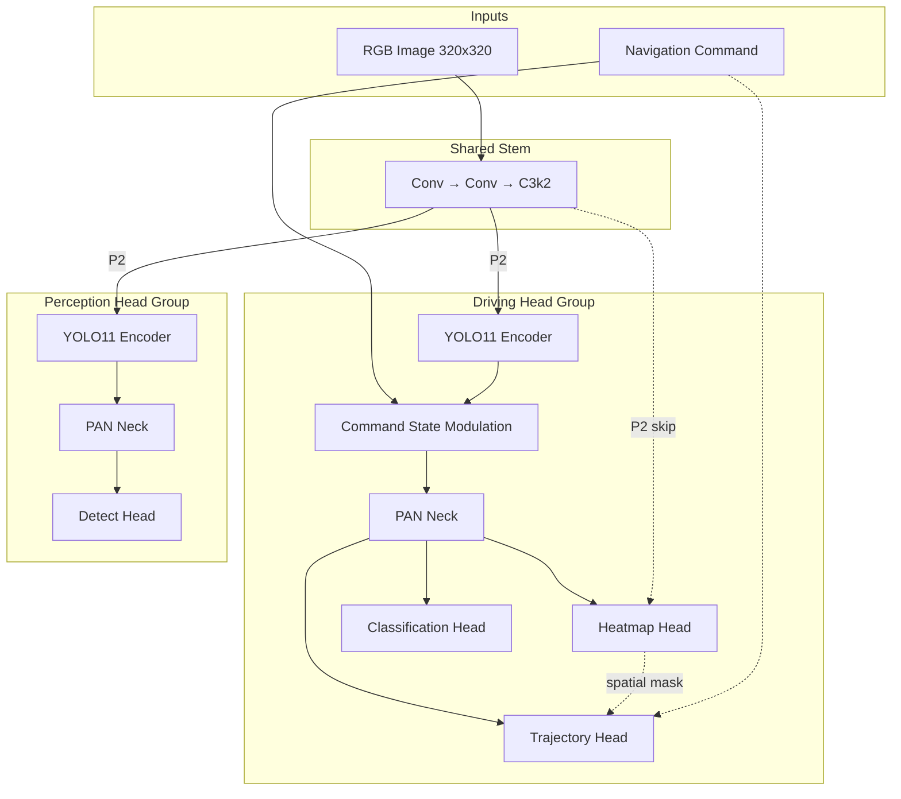

# Introduction to NeuroPilot

Welcome to the documentation for **NeuroPilot** — a unified, high-performance end-to-end (E2E) autonomous driving framework designed for multi-task perception and real-time edge deployment.

import useBaseUrl from '@docusaurus/useBaseUrl';

  

## Overview

NeuroPilot enables self-driving vehicles and robots to perform multiple crucial perception and planning tasks simultaneously within a **single forward pass**. By sharing a unified feature backbone, the network drastically reduces computational overhead, making it ideal for power-constrained hardware like the **NVIDIA Jetson Orin Nano**.

---

## High-Level Pipeline Architecture

Below is the workflow showing how inputs are processed through the shared backbone to separate perception and planning heads:

---

## Core Capabilities

- **Joint Multi-Task Learning**: Shares a single convolutional or attention-based backbone to solve path planning, bounding box detection, saliency heatmap prediction, and command classification simultaneously.
- **Dynamic Task Toggling**: Toggle task heads on/off during training using loss weight multiplier configs (lambdas).
- **Edge-Native Optimization**: Provides built-in TensorRT export engines achieving sub-30ms execution on NVIDIA Jetson Orin Nano boards.
- **Pluggable Backbones**: Swap backbones using a single configuration line, supporting CNNs and ViTs from the `timm` library.
- **Advanced Spatial Guidance**: Features Causal Feature Routing (CFR) to route obstacle-awareness representations into the trajectory planner path.
